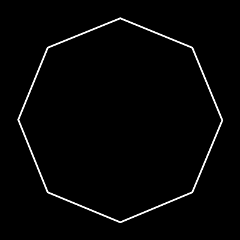

# BMUtils
A small library with a collection of useful functions for BlueMap addons,
that I have created while working on my own BlueMap addons.

Should work with any plugin/mod-loader. Currently only tested with Paper.
Please let me know if you have any issues when using other platforms!

## Installation
There are two ways to use this library:

### Import as a Maven/Gradle dependency
Visit https://jitpack.io/#TechnicJelle/BMUtils for detailed instructions
on how to add this library to your project.

You may want to shade the library!

### Copy the source code
You can also just copy only the specific source code files you need into your own project.\
This is useful if you only need a few functions and don't want to add a whole new dependency.

Please make sure to keep the license and author information in the source code files,
and to abide by the [license](LICENSE) terms!

## Usage/Overview of Features
This section just contains a brief overview of some of the most useful features of this library.\
Please see the javadoc for the full API reference: [technicjelle.com/BMUtils](https://technicjelle.com/BMUtils/com/technicjelle/BMUtils.html)

- [Copy Jar Resource to BlueMap](#copy-jar-resource-to-bluemap)
- [Copy Any File to BlueMap](#copy-any-file-to-bluemap)
- [Copy Any Stream to BlueMap](#copy-any-stream-to-bluemap)
- [Get Player Head Icon Address](#get-player-head-icon-address)
- [Create Marker around a Claimed Area](#create-marker-around-a-claimed-area)
- [Expand/Shrink a Shape](#expandshrink-a-shape)

### Copy Jar Resource to BlueMap
This function copies any resource file from your jar to the BlueMap assets folder.\
Useful for adding custom icons, scripts, or styles from your own addon.\
Any scripts or styles that are copied with this function will be automatically registered with BlueMap.
```java
copyJarResourceToBlueMap(BlueMapAPI, ClassLoader, String fromResource, String toAsset, boolean overwrite)
```

### Copy Any File to BlueMap
This function copies any file to the BlueMap assets folder.\
Useful for copying user-provided assets to BlueMap, from a configuration directory for example.
Any scripts or styles that are copied with this function will be automatically registered with BlueMap.
```java
copyFileToBlueMap(BlueMapAPI, Path from, String toAsset, boolean overwrite)
```

### Copy Any Stream to BlueMap
This function copies any stream to the BlueMap assets folder.\
Useful for when you have a stream of data, for example from a URL.
Any scripts or styles that are copied with this function will be automatically registered with BlueMap.
```java
copyStreamToBlueMap(BlueMapAPI, InputStream in, String toAsset, boolean overwrite)
```

### Get Player Head Icon Address
This function returns the address of a player head icon.\
Useful when you want to use a playerhead from the map.
For example, when adding custom icons to the map that involve the player head.
```java
getPlayerHeadIconAddress(BlueMapAPI, UUID playerUUID, BlueMapMap blueMapMap)
```

### Create Marker around a Claimed Area
With the Cheese class, you can create a [BlueMap Shape](https://bluecolored.de/bluemapapi/latest/de/bluecolored/bluemap/api/math/Shape.html) from a collection of chunks.\
Useful for when you want to create a marker around a claimed area.

Example:
```java
@Event
void onPlayerClaimEvent(Player player, Collection<Chunk> claimedChunks) {
	Collection<Vector2i> chunkCoordinates = claimedChunks.stream()
		.map(chunk -> new Vector2i(chunk.getX(), chunk.getZ()))
		.collect(Collectors.toList());

	Cheese cheese = Cheese.createFromChunks(chunkCoordinates);
	ExtrudeMarker.builder()
		.shape(cheese.getShape())
		.holes(cheese.getHoles())
		//...
		.build();
}
```

You can use `Cheese.createFromCells` to create a Cheese from a collection of non-16x16 cells,
in case your area data isn't chunk-based.

This function works only on areas that are all connected.
It will throw an `InvalidSelectionException` if the areas are separated.\
So for those situations where you have areas that are potentially separated,
you should use the `Cheese.createMultiCheeseFromChunks` function, instead.

_Thanks to [@TBlueF](https://github.com/TBlueF) for contributing this function, and the funny name!_

### Expand/Shrink a Shape
In the ShapeExtensions class, you can find multiple functions to expand or shrink a shape.\
Useful when you just created a shape through a Cheese, and you want to shrink it a little bit to prevent Z-fighting.

There are two kinds of expand/shrink functions: Rect, and Accurate. Both are useful in different situations.

For shapes generated by a Cheese, I would recommend using the Rect functions,
as they work more intuitively on the kind of rectangular shapes that Cheeses generate.\
For example, expanding a 16x16 square by 1 will result in a 18x18 shape, as each side is expanded by 1.

For more complex, free-form shapes, like curves, arcs, ellipses, circles, etc.,
I would recommend using the Accurate functions,
as they work more intuitively on those kinds of shapes.\
For example, expanding a circle with a radius of 8 by 1 will result in a circle with a radius of 9.

There are also some functions for scaling a shape. This is different from expanding/shrinking,
as it will scale the whole shape relative to a single point,
instead of from each separate edge/point of the shape itself.\
You can see a comparison of the two in the following gifs:

| Expand/Shrink                                             | Scale                                     |
|-----------------------------------------------------------|-------------------------------------------|
|  |  |

## Contributing
If you have any suggestions for more useful functions to add, please let me know by creating an issue on GitHub.

## Support
To get support with this library, join the [BlueMap Discord server](https://bluecolo.red/map-discord)
and ask your questions in [#3rd-party-support](https://discord.com/channels/665868367416131594/863844716047106068). You're welcome to ping me, @TechnicJelle.
